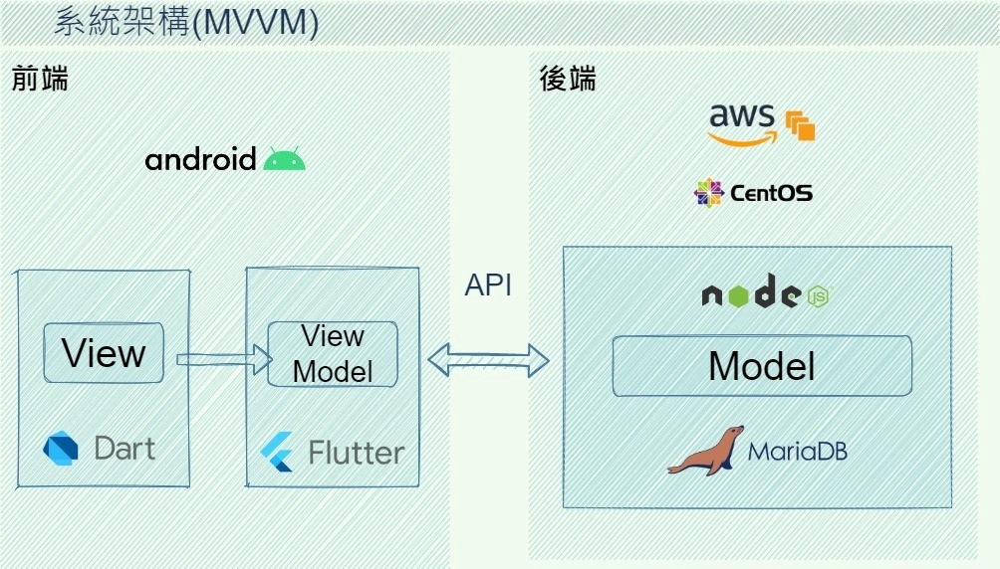
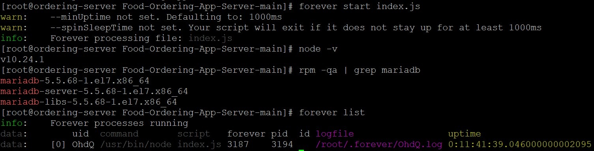
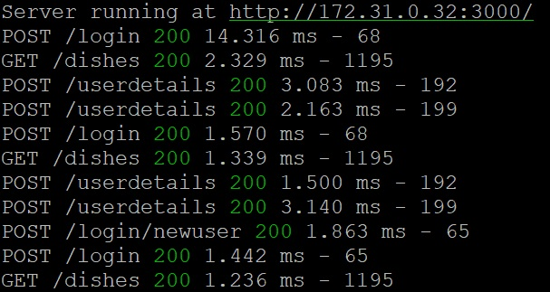
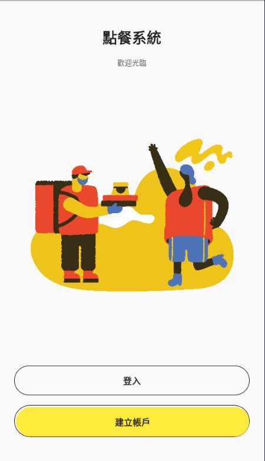
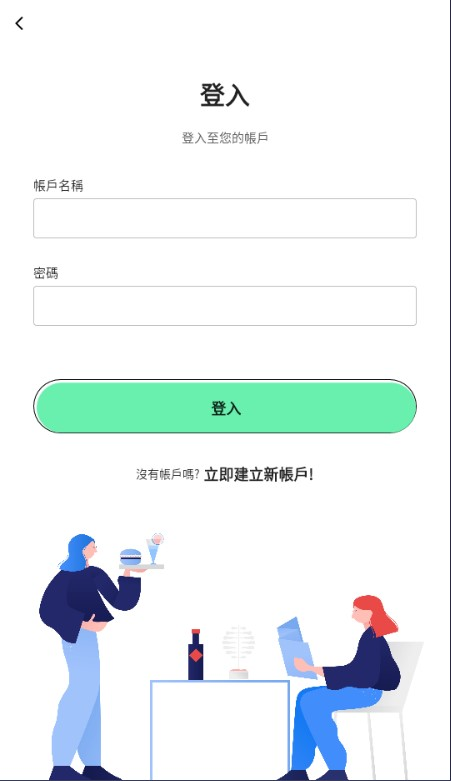
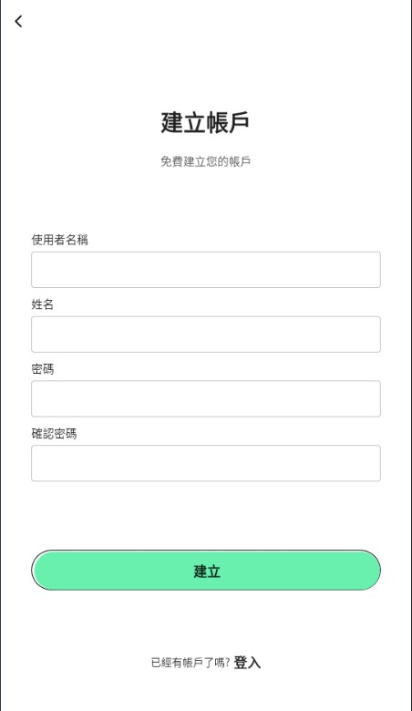
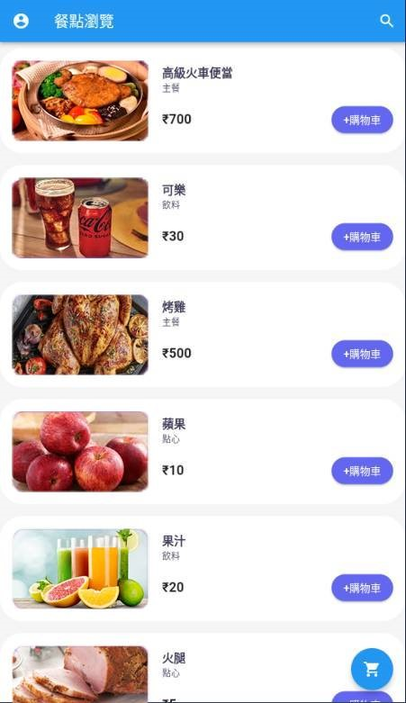
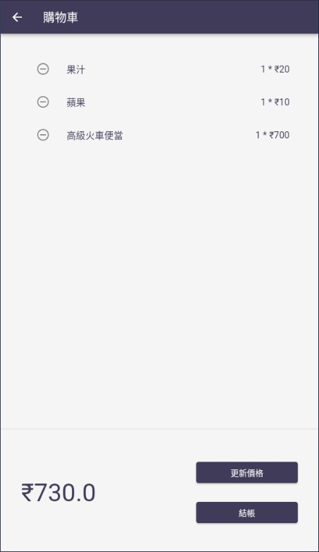
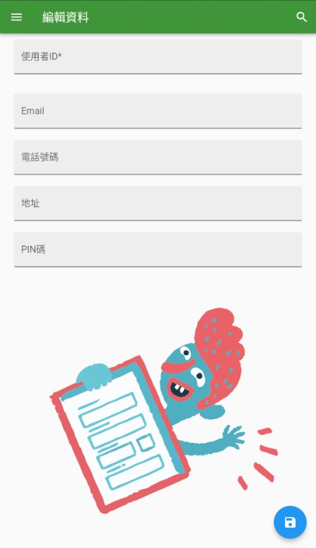
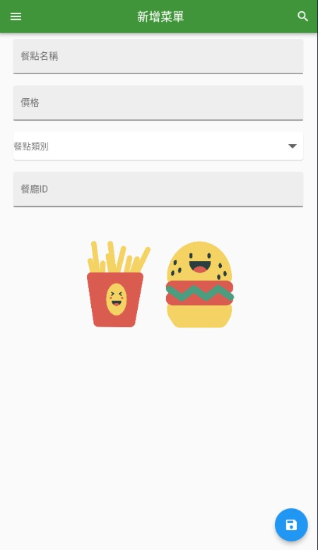

# 架構圖

    </img>

# 後端Demo畫面

### 後端套件

    </img>

### 後端 Node Sever畫面

    </img>

    

# 後端Demo畫面

### 首頁 - 登入 - 註冊 畫面

    

### 餐點瀏覽 - 購物車 畫面

    

### 使用者資料編輯 - 餐點編輯 畫面

    

# Demo影片

</img>

